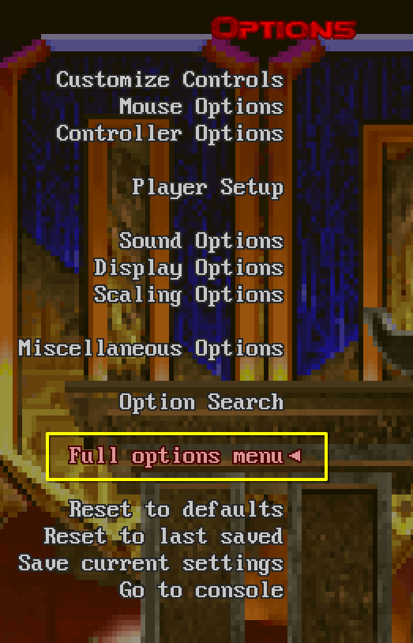
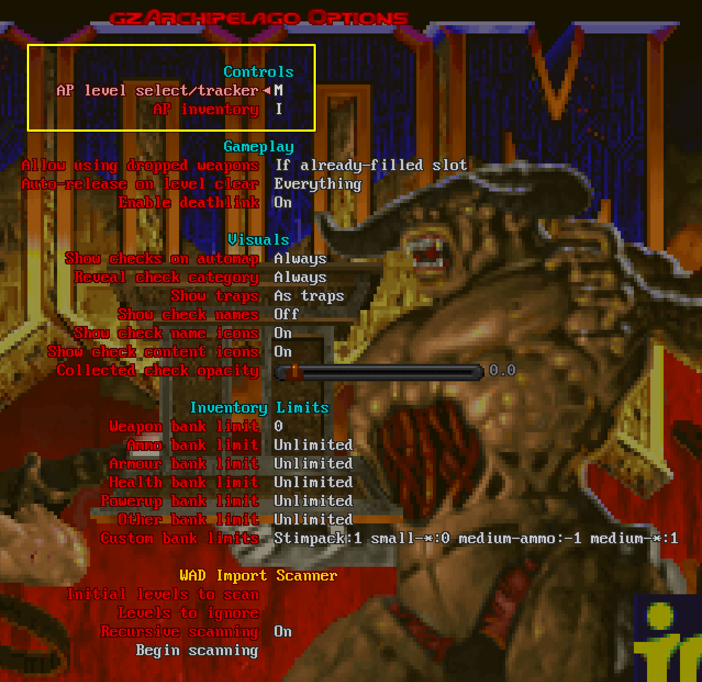

# GZDoom Quickstart

This is a quickstart guide for people new to GZDoom. For complete documentation,
see [the ZDoom Wiki]((https://zdoom.org/wiki/Main_Page).

If you've never used GZDoom before, you will need to download two things:
- [GZDoom itself](https://zdoom.org/downloads)
- A [launcher](https://zdoom.org/wiki/Frontend) to organize your game files
  (including the AP mods and any other mods you want to play with)

This guide assumes that you are using a [ZDL](https://zdoom.org/wiki/ZDL)-based
launcher -- either AceCorp Launcher on Windows, or QZDL on Linux. Other
launchers will also work, but the interface won't be the same as what's
described here.

## Windows Installation

1. Download GZDoom from the above link and extract it into a folder somewhere on
   your computer.
2. Download AceCorp Launcher and put it in the same directory where you extracted
   GZDoom, so that it is in the same folder as gzdoom.exe.
3. Copy your Doom IWAD (e.g. `doom2.wad`) to the same folder.
4. If you're playing a map pack (a "PWAD") rather than the base game, download
   that and put it next to your IWAD.
5. Download the GZDoom AP mod and place it in the same directory as gzdoom.exe.

You should now have directory contents that look something like this:

    gzdoom.exe
    AceCorp Launcher.exe
    doom2.wad  [or doom.wad, heretic.wad, etc]
    demonfear.wad  [or whatever PWAD you're playing, if any]
    gzArchipelago-1.2.3.pk3
    [...plus a bunch of other files that came with gzdoom...]

## Linux Installation

Note: the choice of directory for the IWAD, PWAD, and mod is arbitrary; you can
put them somewhere else (e.g. `~/Games/Doom`) if that's more convenient. These
instructions put them next to your save files, screenshots, and config files.

1. Install `gzdoom` and `qzdl` via your package manager.
2. Create the config directory: `mkdir -p ~/.config/gzdoom`.
3. Copy your Doom IWAD (e.g. `doom2.wad`) to that directory.
4. If you're playing a map pack (a "PWAD") rather than the base game, download
   that and put it next to your IWAD.
5. Download the GZDoom AP mod and place it in the same directory as gzdoom.exe.

## Running the Game

Now that we have prepared the files for playing, we will need to set up the game
and mods in order play.

1. Open the launcher (run `Acecorp Launcher.exe` on Windows or `qzdl` on Linux).
2. In the IWAD dropdown, click the `+` button and select your IWAD file.
3. In the Engine dropdown, click the `+` button and select gzdoom.exe.
4. In the large box under the dropdowns, right click and select Add File, then
   select your downloaded PWAD (if using one).
5. Do the same to add the gzArchipelago pk3 file.

Click Launch to start the game.

## In-game configuration

Once in game, you need to configure gzArchipelago. Select the `Options` Menu:

From there, select `Full options menu` to reveal the hidden options, and verify
that `gzArchipelago Options` appears at the bottom:

Select `gzArchipelago Options` and configure your keybindings for `AP level select`
and `AP inventory`. The rest of the settings can be adjusted to fit your tastes
(and have in-game tooltips describing what they do), but those keybindings are
mandatory.

Having done this, you're all set up and ready to generate and play a game; see
the [setup](./setup.md) and [gameplay](./gameplay.md) docs.
