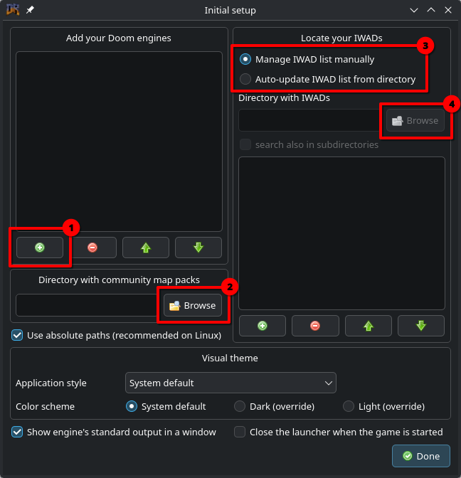
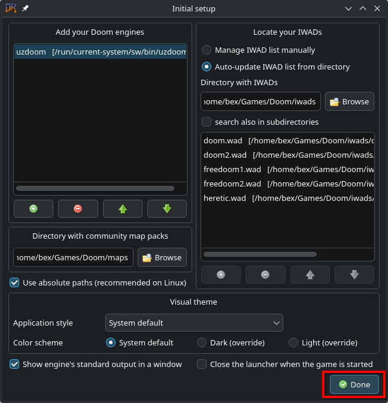
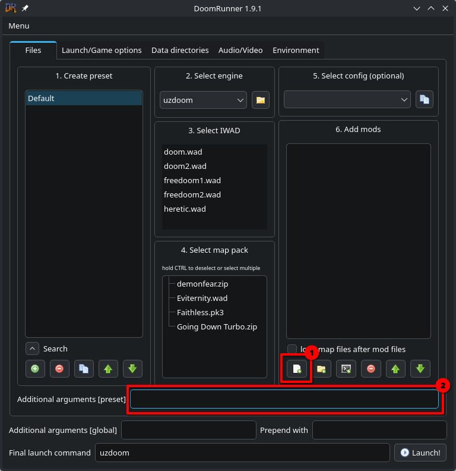
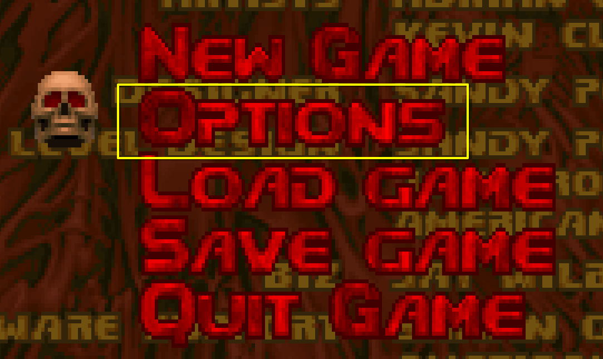
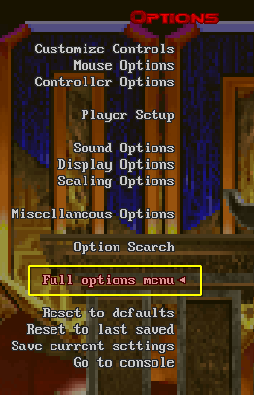
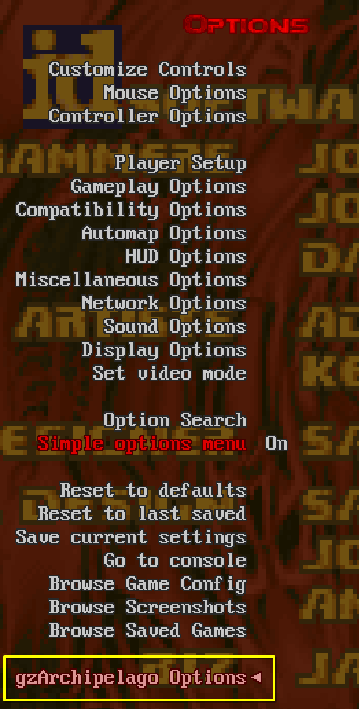
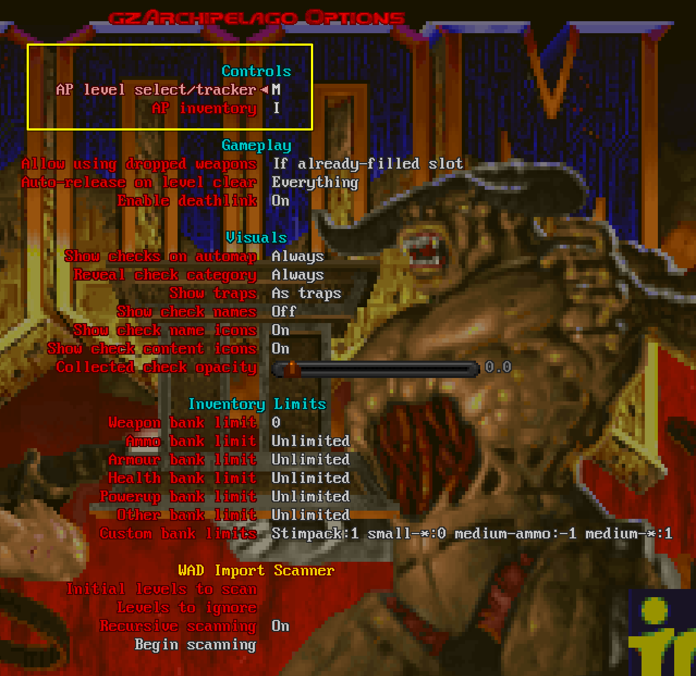
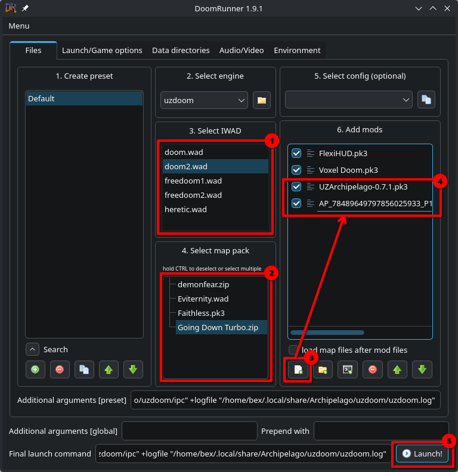

# Setup using DoomRunner

This is a guide for setting up UZDoom using the
[DoomRunner](https://github.com/Youda008/DoomRunner) launcher. Other launchers
will also work, but the interface won't be the same as what's described here.

If you want to use a ZDL-style launcher instead, see [the ZDL guide](./setup-zdl.md).

## Windows Installation

You will need to download two things:
- [UZDoom itself](https://zdoom.org/downloads)
- [DoomRunner](https://github.com/Youda008/DoomRunner/releases)

[the rest of this to be written by someone who understands windows. It's probably
just unpacking UZD and DR into `C:/Games/UZDoom` or something.]

## Linux Installation

Note: the choice of directory for IWADs, PWADs, and mods is arbitrary. These
instructions model them after my own setup, but you can put them somewhere else
if doing so is more convenient for you.

1. Install `uzdoom` and `doomrunner` via your package manager.
2. Create directories for your data:
   `mkdir -p ~/Games/Doom/iwads ~/Games/Doom/maps ~/Games/Doom/mods`
3. Copy your IWADs (e.g. `doom.wad`, `heretic.wad`) to the `~/Games/Doom/iwads` directory.
4. Download your map PWADs (e.g. `dmonfear.wad`, `adventures of square.pk3`) to the `~/Games/Doom/maps` directory.
5. Download `UZArchipelago.pk3` to the `~/Games/Doom/mods` directory.

## Configuration

The first time you start `DoomRunner`, you will be presented with a setup screen:

1. Click the `+` button to add UZDoom as an engine. Browse to where the UZDoom
  program is (probably `/usr/bin/uzdoom` if you installed it through the package
  manager; wherever you unpacked it to if you installed it manually). In the
  `Engine Properties` window that pops up, make sure you select `ZDoom` as the
  `Engine Family`; the rest can be left at default.
2. Click `Browse` and choose your `~/Games/Doom/maps` directory.
3. Switch this setting to `Auto-update IWAD list from directory`.
4. Click `Browse` and choose your `~/Games/Doom/iwads` directory.

When you're done, it should look something like this, although the specific file paths will be different:

Click `Done` and you will be taken to the main user interface:

There is still a small amount of setup to be done here:

1. Click the highlighted `add mod` button and select `~/Games/Doom/mods/UZArchipelago.pk3`
   and any other mods you want.
2. Start Archipelago, click `UZDoom Client`, and when it tells you to `start UZDoom with additional flags`, copy the line after that into the `Additional arguments` box.

Once you've done that, you're all set up and DoomRunner will remember these
settings. Click `Launch` and it will start UZDoom so that you can configure the
in-game settings.

## In-game configuration

Once in game, you need to configure UZArchipelago. Select the `Options` Menu:

From there, select `Full options menu` to reveal the hidden options, and verify
that `UZArchipelago Options` appears at the bottom:

Select `UZArchipelago Options` and configure your keybindings for `AP level select`
and `AP inventory`. The rest of the settings can be adjusted to fit your tastes
(and have in-game tooltips describing what they do), but those keybindings are
mandatory.

Having done this, you're all set up and ready to generate and play a game;
continue with [per-game setup](./setup.md#per-game-setup)

## Playing a game

1. Select the IWAD for the maps you're playing.
2. Select the map pack, if you aren't just playing the IWAD itself.
3. Use `add mod` again to add the patch file for the game you're playing in.
4. Make sure the patch file is enabled and loads after the main `UZArchipelago` mod.
5. `Launch`!
