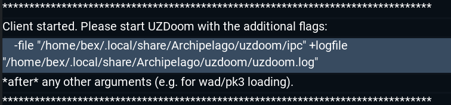

# UZArchipelago Setup

This document describes, in detail, how to set up UZArchipelago. If you are
already familiar with Archipelago and with playing modded UZDoom, you may want
to read the [quickstart guide](./quickstart.md) instead.

For information on how gameplay works once set up, see the [gameplay guide](./gameplay.md).
For a list of supported WADs, see the [support table](./support-table.md). If you
want to add support for a new WAD, see the [new WADs guide](./new-wads.md), but
I strongly recommend going through these instructions, and making sure that
everything is set up properly and the basics work, first.

For troubleshooting information, see [the FAQ](./faq.md).

## Required Software

- **For generating:**
  - [uzdoom.apworld](../../release/uzdoom.apworld)
  - Addon apworlds for [any WADs you intend to play](./support-table.md)
- **For playing:**
  - apworlds:
    - [uzdoom.apworld](../../release/uzdoom.apworld)
    - Addon apworlds for [any WADs you intend to play](./support-table.md)
    - Optional but recommended: [Universal Tracker](https://github.com/FarisTheAncient/Archipelago/releases)
  - [UZArchipelago.pk3](../../release/UZArchipelago-latest.pk3)
    - ⚠️ **It is important that the pk3 version matches the apworld version.**
  - [UZDoom](https://zdoom.org/downloads)
    - Optional but recommended: a launcher like [DoomRunner](https://github.com/Youda008/DoomRunner)
  - The base game data ("IWAD") for the maps you will be playing:
    - ⚠️ If you are using one of [the rereleases](https://www.gog.com/en/games?developers=id-software-nightdive-studios), make sure you get the version of the WAD from the `base/` directory, not `rerelease/`
    - For Doom maps:
      - `DOOM.WAD` from The Ultimate Doom
      - If you don't have Doom, you can use [FreeDoom](https://freedoom.github.io/download.html) Phase 1 instead
    - For Doom II maps:
      - `DOOM2.WAD` from Doom II: Hell on Earth
      - If you don't have Doom II, you can use [FreeDoom](https://freedoom.github.io/download.html) Phase 2 instead
    - For Heretic maps:
      - `HERETIC.WAD` from Heretic or Shadow of the Serpent Riders
      - If you don't have Heretic, you can use [Blasphemer](https://doomwiki.org/wiki/Blasphemer) instead
  - The map data ("PWAD") for the maps you will be playing
    - If you are playing one of the base games (e.g. Doom 1/2, Heretic), everything you need is built into the IWAD, so you can skip this
    - Otherwise you can usually find download links by searching for your WAD on [the DoomWiki](https://doomwiki.org/)

## First-time setup

You will need to do these steps once when first setting up, and after that
should be able to leave things as-is.

### Archipelago

Install the apworlds. Depending on how you installed Archipelago, this may be
as simple as double-clicking on them, or you may need to manually copy them to
your `worlds` or `custom_worlds` AP directory.

Start Archipelago and click `Generate Template Options`. It should produce a
YAML template named `UZDoom (Wad Name).yaml` for every WAD you installed support
for.

### UZDoom

🛈 You can find general documentation about UZDoom on [the ZDoom Wiki](https://zdoom.org/wiki/Main_Page).

🛈 It is highly recommended that you use a launcher program. Most launchers
should work, but there are dedicated guides to setting up AP with
[DoomRunner](./setup-doomrunner.md) (the apworld author's favourite) and with
[QZDL, AceCorp, and other ZDL-based launchers](./setup-zdl.md) (the most popular
overall). What follows are the generic, launcher-agnostic instructions.

Add the `UZArchipelago.pk3` to your mod load order. You will need this loaded for
every AP game.

Start Archipelago and click `UZDoom Client`. It will display some extra command
line options to use with UZDoom. Add these to your UZDoom launch configuration;
you will need them for every AP game (and they will be the same for each game).
You can click on them in the client, which will hilight them and copy them to
the clipboard:

Finally, start up UZDoom, go into the options menu, turn off `Simple Options Menu`
if it's on, and use the `UZArchipelago Options` to configure the mod to your
taste. Make sure to bind keys for `AP level select` and `AP inventory`.

## Per-game setup

These are steps you will have to do for each game you want to play.

### Game Generation

Copy the generated YAML from your AP `Players/Templates/` directory to `Players/`.
Edit it as you see fit -- the defaults should work out of the box, but you may
want to tweak things and should at least select a player name.

- **If you are generating**: start Archipelago and click `Generate`.
- **If someone else is generating**: send them your YAML, `uzdoom.apworld`, and the
  wad-specific apworld for your YAML.

### Patch setup

UZAP requires a per-game patch file that contains information about which items
were placed where.

- **If the game has a room link**: download the patch by clicking the `Download
  patch file` link in that room.
- **If you are hosting**: you can find it inside the `AP_1234.zip` file produced
  by `Generate`. It will be named something like `AP_1234_P0_PlayerName.WadName.pk3`.
- **If someone else is hosting**: ask them to send you the patch file.

Once you have the patch file, add it to the end of your UZDoom load order, so
that it loads after both the WAD you are playing and the main `UZArchipelago.pk3`.
Also make sure that you have selected the right IWAD and, if applicable, PWAD.
([DoomRunner example](./setup-doomrunner.md#playing-a-game).)

If there are any in-game settings you want to adjust, such as deathlink, this
is also a good time to start up UZDoom and do that, before starting the game
proper.

## Starting the game

### Solo play

UZArchipelago has fully integrated solo-play support that does not require a
separate Archipelago host. Simply start UZDoom and select `New Game` as normal,
then choose a difficult setting matching what you configured in your YAML. If
you need a break, you can save and exit, and resume your saved game later.
UZDoom will not mind

If you do want to run the client (for the Universal Tracker integration, or
because you are a logic developer and want it to record [tuning files](./new-wads.md)),
follow the instructions for multiworld play below.

Once in-game, consult the [gameplay guide](./gameplay.md) for more details.

## Multi-world

UZDoom cannot directly connect to the Archipelago host, so it requires an
external client program, built into the apworld, to act as a go-between.

Start up Archipelago and click `UZDoom Client`. This should open a new window
showing you the command line flags you added to UZDoom during the first-time
setup.

Once that is running, start UZDoom and select `New Game`. Choose a difficulty
setting matching what you configured in your YAML. The game should load into a
level select screen and you should shortly see a message at the top of the
screen saying that the Archipelago connection has been established.

Once this happens, the AP client program should connect automatically (using
information in the patch file). If it doesn't (for example, because the port for
your AP room has changed since the game was generated), you can manually enter
the AP address into the client and click `Connect`. You must do this *after* the
game starts up and connects to the client, so that it knows which WAD you're
playing.

If you need to stop playing and resume later, you can save and exit your game as
normal. When returning to it, restore your save (via `Load Game` in the main
menu; **do not** start a new game and then load your game from there) and AP
will sync any items that you missed while offline.

Once in-game, consult the [gameplay guide](./gameplay.md) for more details.
